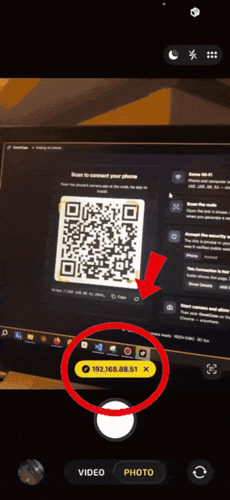
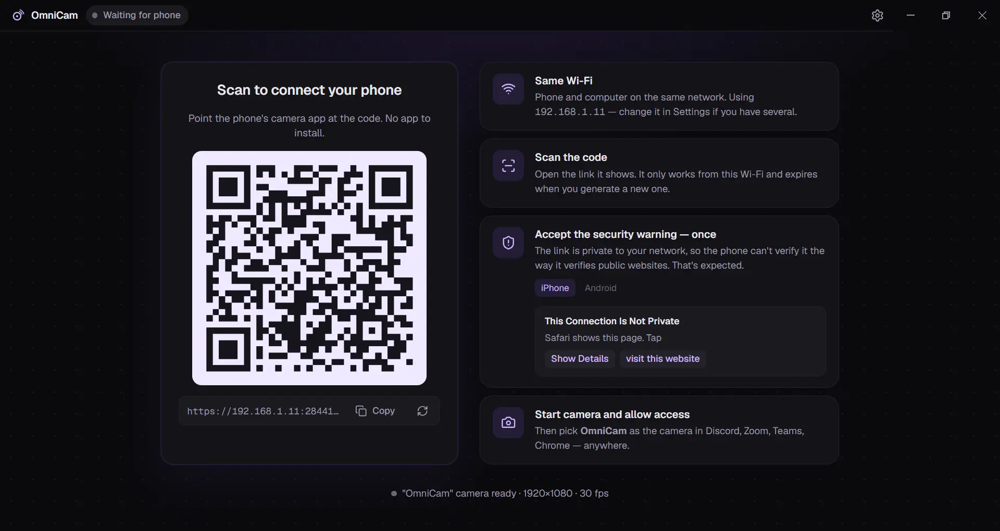
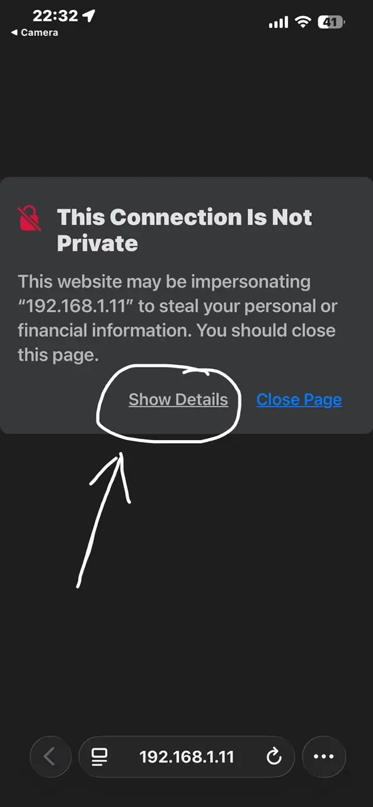
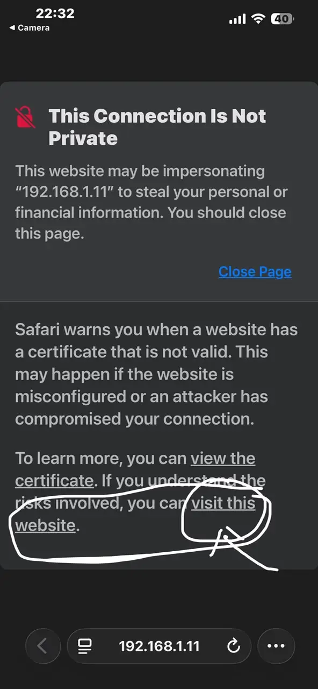
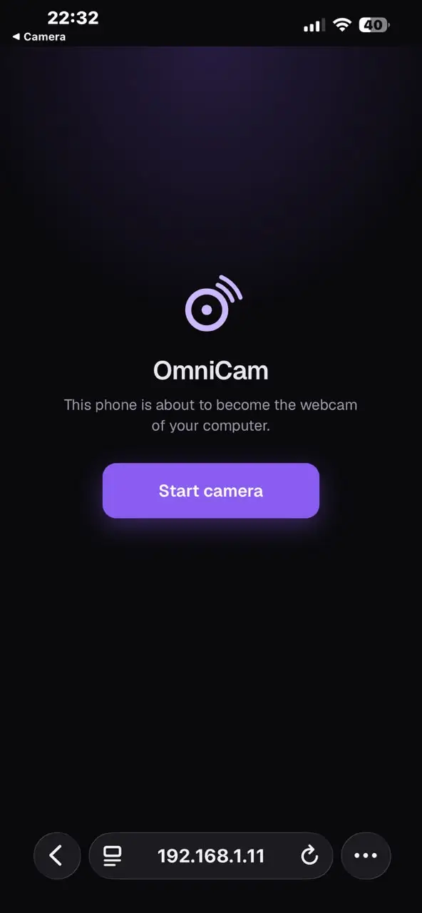
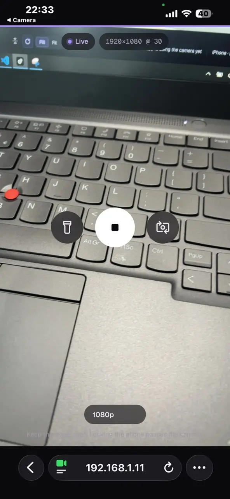
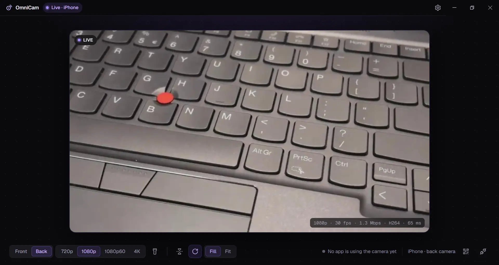
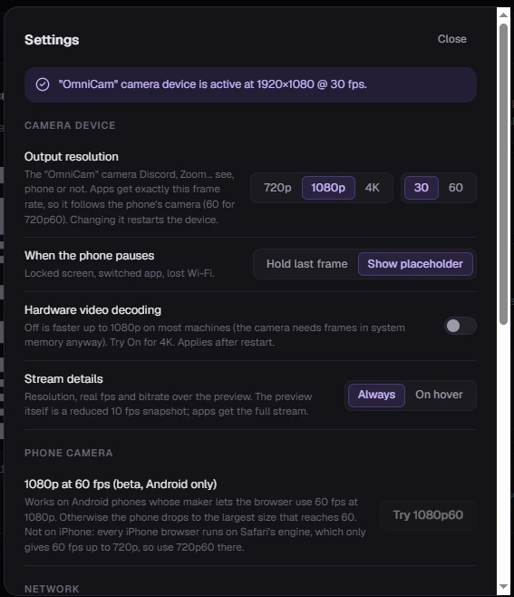
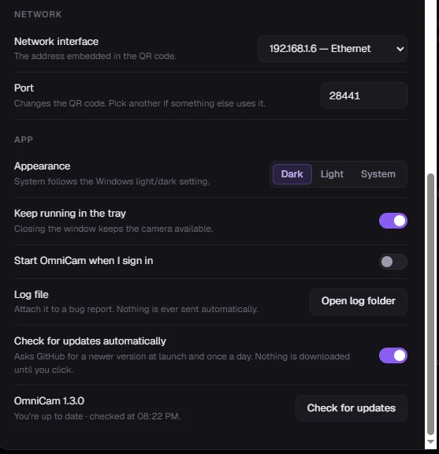

<p align="center">
  
</p>

<h1 align="center">OmniCam</h1>

<p align="center">
  Your phone's camera as a webcam on your PC — <strong>nothing to install on the phone</strong>.
</p>

<p align="center">
  <a href="https://github.com/Orest-Z/OmniCam/releases/latest"></a>
</p>

<p align="center">
  <a href="https://orest-z.github.io/OmniCam/">Website</a> ·
  <a href="PRIVACY.md">Privacy</a> ·
  <a href="CODE_SIGNING.md">Code signing</a> ·
  <a href="SECURITY.md">Security</a>
</p>

<p align="center">
  <a href="https://github.com/Orest-Z/OmniCam/actions/workflows/build.yml"></a>
  
  
  
  <a href="LICENSE"></a>
</p>

<table align="center">
  <tr>
    <td align="center" valign="middle" width="640">
      
    </td>
    <td align="center" valign="middle" width="190">
      
    </td>
  </tr>
  <tr>
    <td align="center"><sub><b>On the PC</b> — show the QR code, wait, go live.</sub></td>
    <td align="center"><sub><b>On the phone</b> — scan, accept once, tap Start.</sub></td>
  </tr>
</table>

Scan a QR code, tap **Start camera**, and a camera named **OmniCam** appears in Discord, Zoom, Google Meet,
Chrome, OBS — anything that lists webcams. Video goes phone → PC directly over your Wi-Fi with hardware-encoded
H.264; nothing leaves your network, and there is no account, no cloud and no app store.

- **Phone side** — any modern browser: iPhone (Safari) or Android (Chrome). It's just a web page served by your PC.
- **Quality** — 720p, 720p60, 1080p or 4K from the phone's camera, hardware H.264, latency on par with a native camera app.
- **Controls** — front/back camera, torch (a screen light on the front camera), resolution, mirror, rotate, Fill/Fit — from the PC or from the phone. Light or dark desktop app.
- **Stays out of the way** — runs from the tray; closing the window keeps the camera live. The phone drops to 5 fps
  once no app is using the camera *and* the OmniCam window is closed or hidden.
- **Costs the phone battery** — the page has to stay open with the screen on, so plan on charging during long
  sessions. [What it costs the phone](#what-it-costs-the-phone)

### How it compares

|                          | OmniCam                  | DroidCam          | Iriun             | Camo              | EpocCam           |
| ------------------------ | ------------------------ | ----------------- | ----------------- | ----------------- | ----------------- |
| App to install on phone  | **none — a web page**    | required          | required          | required          | required          |
| Price                    | **free, MIT**            | free tier + paid  | free tier + paid  | free tier + paid  | free tier + paid  |
| Open source              | **yes**                  | no                | no                | no                | no                |
| Account / cloud          | **none**                 | none              | none              | account           | none              |
| Video path               | phone → PC on your Wi-Fi | Wi-Fi / USB       | Wi-Fi / USB       | Wi-Fi / USB       | Wi-Fi / USB       |
| Microphone               | not yet                  | yes               | yes               | yes               | yes               |

The trade-off for "no app" is a browser security warning the first time (explained below), and USB is not an option
yet — a phone hotspot or USB tethering with the PC on it works as a stand-in.

### What it costs the phone

Streaming costs the phone about as much as a long video call: the camera, the H.264 encoder and the Wi-Fi radio all
run the whole time. On top of that, because the phone side is a **web page rather than a native app**, the page has to
stay in the foreground with the screen on — a native app could keep streaming with the screen off. So expect a warm
phone and real battery drain, and keep it on a charger for anything long.

What OmniCam does about it: the phone captures at the resolution you pick and nothing more, encoding is always the
phone's hardware H.264 encoder, and the stream drops to 5 fps once no app on the PC is using the camera and the
OmniCam window is hidden. That saves battery while you are idle — not while you are actually on a call. It also keeps
the screen awake where the browser allows it (iOS 16.4+, Android Chrome); where it doesn't, locking the phone pauses
the camera until you wake it.

### What it doesn't do (yet)

- **No microphone.** Video only — your usual mic keeps working. A virtual mic is on the roadmap.
- **Windows only.** Windows 10 (1809+) and Windows 11, 64-bit. macOS and Linux are on the roadmap.
- **DirectShow cameras only.** The Windows Camera app and the new Microsoft Teams use the newer Windows camera stack
  and will not list OmniCam. Discord, Zoom, Google Meet, Chrome, Firefox, OBS and Slack do.
- **A browser warning the first time** on each phone, per network — unavoidable without a public certificate, and
  explained step by step below.
- **One phone at a time.** Scanning the code with another phone replaces the current one.
- **The installer isn't code-signed yet**, so SmartScreen asks you to confirm. Signing through SignPath
  Foundation is being set up; [CODE_SIGNING.md](CODE_SIGNING.md) has the policy.
- **No USB path yet** — Wi-Fi, or a hotspot/tethering so both devices share one network.

---

## Install (Windows)

1. Download **`OmniCam-Setup-x.y.z.exe`** from the [latest release](https://github.com/Orest-Z/OmniCam/releases/latest) and run it.
2. Windows SmartScreen may say *"Windows protected your PC"* — the installer isn't code-signed yet.
   Click **More info → Run anyway**.
3. The installer registers the **OmniCam** camera device and adds a Windows Firewall rule (it asks for administrator rights for that).

Windows 10 (1809 or newer) and Windows 11, 64-bit.

Want to check what you downloaded? Each release lists the installer's SHA-256, and every installer
carries a signed attestation that it was built by this repository's GitHub Actions from the tagged
commit: `gh attestation verify OmniCam-Setup-x.y.z.exe --repo Orest-Z/OmniCam`.

---

## Set up your phone

Takes about thirty seconds, once. After that the phone just needs to scan the code.

### 1 · Open OmniCam and scan the QR code

<p align="center">
  
</p>

Your phone and PC must be on the **same Wi-Fi**. Point the phone's camera app at the code and open the link it shows.
The link only works from your network and changes every time you generate a new one.

### 2 · Accept the security warning — it's expected, and it's once

**Why the warning?** Browsers only allow camera access over HTTPS, and a certificate for a private address like
`192.168.1.11` can't be issued by a public authority, so OmniCam makes its own. The phone is talking to your PC
directly — nothing else is on that link — but the browser has no way to know that, so it warns once. Accepting it
applies only to this address on this network. (A warning-free mode with a real certificate is on the roadmap.)

Here's exactly what to tap on an iPhone:

<table align="center">
  <tr>
    <th align="center" width="25%">① Safari warns you</th>
    <th align="center" width="25%">② Tap "visit this website"</th>
    <th align="center" width="25%">③ Start the camera</th>
    <th align="center" width="25%">④ You're live</th>
  </tr>
  <tr>
    <td align="center"></td>
    <td align="center"></td>
    <td align="center"></td>
    <td align="center"></td>
  </tr>
  <tr>
    <td align="center"><sub>Tap <b>Show Details</b>, not Close Page.</sub></td>
    <td align="center"><sub>The link is at the very bottom of the text.</sub></td>
    <td align="center"><sub>Tap <b>Start camera</b>, then <b>Allow</b> camera access.</sub></td>
    <td align="center"><sub>Flip camera, torch and resolution are on the page too.</sub></td>
  </tr>
</table>

> **Android (Chrome):** the warning reads *"Your connection is not private"*. Tap **Advanced**, then **Proceed to 192.168.…**.
> The rest is identical.

### 3 · Pick "OmniCam" as your camera

In Discord, Zoom, Google Meet, Teams (classic), Chrome, Firefox, OBS, Slack… open the camera picker and choose **OmniCam**.
Apps list cameras when they start, so restart an app that was already open.

---

## While you're live

<p align="center">
  
</p>

The desktop window shows exactly what the camera device outputs (WYSIWYG, including Fill/Fit and rotation)
with live stats: resolution, fps, bitrate, codec and network round-trip time.

| Control              | What it does                                                                                       |
| -------------------- | -------------------------------------------------------------------------------------------------- |
| **Front / Back**     | Switch the phone's camera.                                                                         |
| **720p · 720p60 · 1080p · 4K** | Capture resolution on the phone. Bitrate follows automatically. 60 fps is 720p: phone browsers only offer it below 1080p. |
| **Torch**            | Phone flashlight, on and off from either side. On the front camera the phone screen turns white to light your face (turn its brightness up: a web page can't). |
| **Mirror · Rotate**  | Fix the orientation for how you hold the phone.                                                    |
| **Fill / Fit**       | *Fill* (default) crops a portrait phone into a proper 16:9 picture; *Fit* shows everything with bars. |
| **QR · Disconnect**  | Bring the QR code back while live, or drop the phone: it stops, says why, and a new QR code is ready. |

Hold the phone in landscape for the best picture. Keep the page open — locking the phone or switching apps pauses
the camera, and it resumes when you come back (the last frame is held meanwhile, or a placeholder if you prefer).

---

## Settings

<table>
  <tr>
    <td width="55%" valign="top">

**Camera device**
- **Output resolution** — what Discord, Zoom… receive: 720p, 1080p or 4K at 30 or 60 fps. The frame rate follows the phone (60 for 720p60). 4K is for OBS and recording; Discord, Zoom and Teams send at most 1080p. Consumer apps negotiate a format once, so this is fixed while they run; the phone picture is scaled into it.
- **When the phone pauses** — hold the last frame or show a placeholder.
- **Hardware video decoding** — off by default; software decoding measured faster up to 1080p. Try on for 4K.
- **Stream details** — the resolution, real fps and bitrate over the preview: always (default) or on hover. The preview itself is a reduced 10 fps snapshot; apps get the full stream.

**Phone camera**
- **1080p at 60 fps (beta, Android only)** — some Android phones reach 60 fps at 1080p in the browser; others drop to a smaller size at 60. iPhones can't: every iPhone browser runs on Safari's engine, which only gives 60 fps up to 720p.

**Network**
- **Network interface** — the address embedded in the QR code. Pick your Wi-Fi adapter if you have VPNs or virtual adapters.
- **Port** — change it if something else uses it.

**App**
- **Appearance** — Dark (default), Light or System. The sun/moon button next to Settings switches it in one click.
- **Keep running in the tray** — closing the window keeps the camera available. Off: closing the window quits OmniCam.
- **Start with Windows.**
- **Check for updates** — OmniCam also checks quietly when it starts and once a day, unless you turn off
  *Check for updates automatically*; that check is the only connection it makes beyond your network ([PRIVACY.md](PRIVACY.md)). When a new version is out, an *Update available* badge appears in the title bar; nothing is downloaded or installed until you click.

</td>
    <td width="45%" align="center">
      
      
    </td>
  </tr>
</table>

---

## Troubleshooting

<details>
<summary><strong>The phone can't open the page</strong></summary>

- Phone and PC must be on the **same Wi-Fi** — not mobile data, not a guest network.
- Some routers isolate Wi-Fi devices from each other (*AP isolation* / *client isolation*). Turn it off, use another
  network, or start a hotspot on the phone and connect the PC to it.
- If Windows asked about the firewall when OmniCam first started, allow it for private networks. The installer adds a
  rule for you; re-run it if in doubt.
- Several network interfaces (VPN, virtual adapters)? Pick the Wi-Fi one under **Settings → Network interface** so the
  QR code uses the right address.
</details>

<details>
<summary><strong>"OmniCam" doesn't show up as a camera</strong></summary>

- Restart the app that should use it — apps list cameras at start.
- The installer registers the camera driver; run it again if the device is missing.
- Apps that only use the newer Windows camera stack (the Windows Camera app, the new Microsoft Teams) don't see
  DirectShow cameras. Discord, Zoom, Google Meet, Chrome, Firefox, OBS, Slack and most others do.
</details>

<details>
<summary><strong>The picture is sideways or squashed</strong></summary>

Use **Rotate** and **Fill/Fit** on the desktop. *Fill* crops a portrait phone into 16:9; *Fit* keeps everything with
bars. Holding the phone in landscape avoids both.
</details>

<details>
<summary><strong>Something else — where are the logs?</strong></summary>

Settings → **Open log folder** (`%APPDATA%\OmniCam\logs\omnicam.log`). It records connections, the camera device
state and any crashes, and nothing is ever uploaded. Attach it when you
[open an issue](https://github.com/Orest-Z/OmniCam/issues).
</details>

<details>
<summary><strong>Uninstall</strong></summary>

Settings → Apps → OmniCam → Uninstall. This removes the camera device and the firewall rule.
</details>

---

## How it works

```
PHONE (browser)                                DESKTOP
  camera ── H.264 ── WebRTC over Wi-Fi ──────►  Electron engine ──► native pipeline ──► "OmniCam" camera
                       peer-to-peer                (WebRTC receiver)   (libyuv, C++)      (DirectShow, x64 + x86)
```

- The PC runs a tiny HTTPS server that serves the phone page and a one-shot signaling endpoint. The QR code carries a
  per-launch random token; only one phone can be connected at a time.
- Video is WebRTC, peer-to-peer on your LAN. The desktop's ICE candidate is a real LAN IP so it also works on Wi-Fi
  that blocks mDNS.
- Frames never cross process boundaries as pixels: the native pipeline scales, rotates and converts them and hands
  them to OmniCam's own DirectShow virtual camera filter (built on [softcam](https://github.com/tshino/softcam)).
- Nothing is copied or converted while no app reads the camera; the phone is told to drop to 5 fps to save battery.

Typical cost while streaming 1080p into an app: about a quarter of a CPU core and flat memory over long sessions.
`ARCHITECTURE.md` has the full architecture and the reasoning behind every design decision.

---

## Development

Prerequisites (Windows): Node ≥ 20, Visual Studio 2022 Build Tools with the C++ workload,
CMake ≥ 3.20 (`pip install cmake` is fine).

```
git clone --recursive https://github.com/Orest-Z/OmniCam.git
cd OmniCam
npm install
npm run native:build      # N-API addon + DirectShow filter DLLs (x64, x86)
npm run native:register   # admin, once: registers the "OmniCam" camera device
npm run dev               # phone page + Electron with HMR
npm run dist              # NSIS installer
```

Without the native build the app still runs (QR, phone connection, preview) and reports "native addon not available"
— handy for working on the web and UI parts.

## Roadmap

- Windows 11 Media Foundation virtual camera (for the Windows Camera app and new Teams)
- macOS (CoreMediaIO camera extension) and Linux (v4l2loopback)
- Code signing (in progress, through SignPath Foundation)
- Optional "no-warning mode" with a real certificate
- Virtual microphone

## AI involvement

I built OmniCam, and I used AI assistance (Claude Code) along the way. Since people ask, here is the
honest split.

**Mine:** the idea and the product constraints, the architecture and every design decision recorded in
[ARCHITECTURE.md](ARCHITECTURE.md), the choice of stack, the signalling and WebRTC design, the native
frame pipeline, the UI and UX, and the debugging it took to make all of it work on real phones.

**Where AI helped:** parts of the implementation and refactoring, documentation, the release pipeline,
and most usefully, testing and review. A QA pass drove a packaged build end to end with a browser
standing in for the phone (the `auto=1` hook on the phone page exists for that), then went at the
pairing endpoint with wrong tokens, malformed SDP, oversized bodies, path-traversal attempts and
rate-limit probing, and checked how the app behaves when the certificate's network changes or its port
is already taken. That pass found real bugs, and the fixes shipped: a pairing budget low enough to lock
out a phone that had done nothing wrong, refused pairings that left no trace in the log, a port
fallback the UI never admitted to, and a certificate that was re-issued on every network change, so
phones had to accept the warning again and again.

**What that is not:** a security audit, or a guarantee. OmniCam opens a port on your network and
installs a camera driver. The threat model, the deliberate trade-offs and how to report something
privately are in [SECURITY.md](SECURITY.md). If you find a hole, I want to hear about it.

## Contributing

Issues and pull requests are welcome — [CONTRIBUTING.md](CONTRIBUTING.md) covers the build, the house style and what
to put in a pull request, and [ARCHITECTURE.md](ARCHITECTURE.md) explains why the project is built the way it is.
Found something security-sensitive? [SECURITY.md](SECURITY.md) says how to report it privately.
[PRIVACY.md](PRIVACY.md) lists every connection the app makes, and [CODE_SIGNING.md](CODE_SIGNING.md) what gets
signed and by whom.

## License

MIT — see [LICENSE](LICENSE). Bundles [softcam](https://github.com/tshino/softcam) (MIT),
[libyuv](https://chromium.googlesource.com/libyuv/libyuv) (BSD), [Geist](https://vercel.com/font) (OFL),
[Electron](https://www.electronjs.org/) (MIT) and [Lucide](https://lucide.dev/) (ISC).
