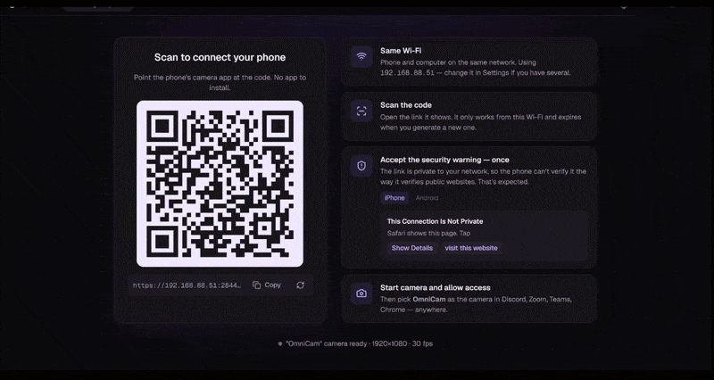
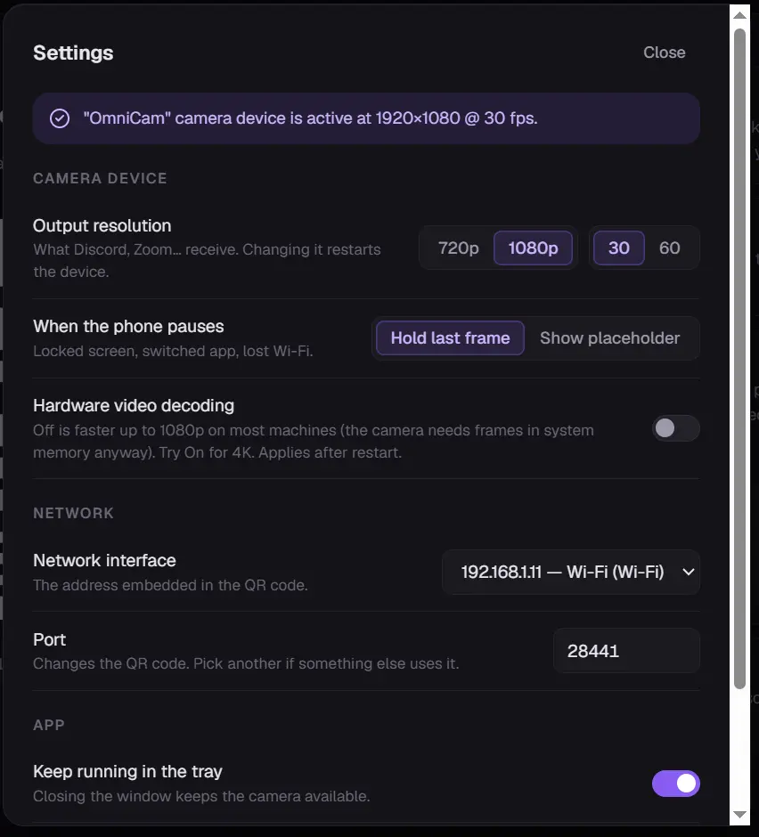

<p align="center">
  
</p>

<h1 align="center">OmniCam</h1>

<p align="center">
  Your phone's camera as a webcam on your PC — <strong>nothing to install on the phone</strong>.
</p>

<p align="center">
  <a href="https://github.com/Orest-Z/OmniCam/releases/latest"></a>
</p>

<p align="center">
  
  
  
  <a href="LICENSE"></a>
</p>

<table align="center">
  <tr>
    <td align="center" valign="middle" width="640">
      
    </td>
    <td align="center" valign="middle" width="190">
      
    </td>
  </tr>
  <tr>
    <td align="center"><sub><b>On the PC</b> — show the QR code, wait, go live.</sub></td>
    <td align="center"><sub><b>On the phone</b> — scan, accept once, tap Start.</sub></td>
  </tr>
</table>

Scan a QR code, tap **Start camera**, and a camera named **OmniCam** appears in Discord, Zoom, Google Meet,
Chrome, OBS — anything that lists webcams. Video goes phone → PC directly over your Wi-Fi with hardware-encoded
H.264; nothing leaves your network, and there is no account, no cloud and no app store.

- **Phone side** — any modern browser: iPhone (Safari) or Android (Chrome). It's just a web page served by your PC.
- **Quality** — 720p, 1080p, 1080p60 or 4K from the phone's camera, hardware H.264, latency on par with a native camera app.
- **Controls** — front/back camera, torch, resolution, mirror, rotate, Fill/Fit — from the PC or from the phone.
- **Stays out of the way** — runs from the tray; closing the window keeps the camera live. The phone drops to 5 fps
  whenever nothing on the PC is using the camera.

---

## Install (Windows)

1. Download **`OmniCam-Setup-x.y.z.exe`** from the [latest release](https://github.com/Orest-Z/OmniCam/releases/latest) and run it.
2. Windows SmartScreen may say *"Windows protected your PC"* — the installer isn't code-signed yet.
   Click **More info → Run anyway**.
3. The installer registers the **OmniCam** camera device and adds a Windows Firewall rule (it asks for administrator rights for that).

Windows 10 (1809 or newer) and Windows 11, 64-bit.

---

## Set up your phone

Takes about thirty seconds, once. After that the phone just needs to scan the code.

### 1 · Open OmniCam and scan the QR code

<p align="center">
  
</p>

Your phone and PC must be on the **same Wi-Fi**. Point the phone's camera app at the code and open the link it shows.
The link only works from your network and changes every time you generate a new one.

### 2 · Accept the security warning — it's expected, and it's once

The link is private to your Wi-Fi, so the phone can't verify it the way it verifies public websites.
Here's exactly what to tap on an iPhone:

<table align="center">
  <tr>
    <th align="center" width="25%">① Safari warns you</th>
    <th align="center" width="25%">② Tap "visit this website"</th>
    <th align="center" width="25%">③ Start the camera</th>
    <th align="center" width="25%">④ You're live</th>
  </tr>
  <tr>
    <td align="center"></td>
    <td align="center"></td>
    <td align="center"></td>
    <td align="center"></td>
  </tr>
  <tr>
    <td align="center"><sub>Tap <b>Show Details</b>, not Close Page.</sub></td>
    <td align="center"><sub>The link is at the very bottom of the text.</sub></td>
    <td align="center"><sub>Tap <b>Start camera</b>, then <b>Allow</b> camera access.</sub></td>
    <td align="center"><sub>Flip camera, torch and resolution are on the page too.</sub></td>
  </tr>
</table>

> **Android (Chrome):** the warning reads *"Your connection is not private"*. Tap **Advanced**, then **Proceed to 192.168.…**.
> The rest is identical.

### 3 · Pick "OmniCam" as your camera

In Discord, Zoom, Google Meet, Teams (classic), Chrome, Firefox, OBS, Slack… open the camera picker and choose **OmniCam**.
Apps list cameras when they start, so restart an app that was already open.

---

## While you're live

<p align="center">
  
</p>

The desktop window shows exactly what the camera device outputs (WYSIWYG, including Fill/Fit and rotation)
with live stats: resolution, fps, bitrate, codec and network round-trip time.

| Control              | What it does                                                                                       |
| -------------------- | -------------------------------------------------------------------------------------------------- |
| **Front / Back**     | Switch the phone's camera.                                                                         |
| **720p · 1080p · 1080p60 · 4K** | Capture resolution on the phone. Bitrate follows automatically.                         |
| **Torch**            | Phone flashlight (back camera, where the browser supports it).                                     |
| **Mirror · Rotate**  | Fix the orientation for how you hold the phone.                                                    |
| **Fill / Fit**       | *Fill* (default) crops a portrait phone into a proper 16:9 picture; *Fit* shows everything with bars. |
| **QR · Disconnect**  | Bring the QR code back while live, or drop the phone.                                              |

Hold the phone in landscape for the best picture. Keep the page open — locking the phone or switching apps pauses
the camera, and it resumes when you come back (the last frame is held meanwhile, or a placeholder if you prefer).

---

## Settings

<table>
  <tr>
    <td width="55%" valign="top">

**Camera device**
- **Output resolution** — what Discord, Zoom… receive: 720p or 1080p at 30 or 60 fps. Consumer apps negotiate a format once, so this is fixed while they run; the phone picture is scaled into it.
- **When the phone pauses** — hold the last frame or show a placeholder.
- **Hardware video decoding** — off by default; software decoding measured faster up to 1080p. Try on for 4K.

**Network**
- **Network interface** — the address embedded in the QR code. Pick your Wi-Fi adapter if you have VPNs or virtual adapters.
- **Port** — change it if something else uses it.

**App**
- **Keep running in the tray** — closing the window keeps the camera available.
- **Start with Windows.**

</td>
    <td width="45%" align="center">
      
    </td>
  </tr>
</table>

---

## Troubleshooting

<details>
<summary><strong>The phone can't open the page</strong></summary>

- Phone and PC must be on the **same Wi-Fi** — not mobile data, not a guest network.
- Some routers isolate Wi-Fi devices from each other (*AP isolation* / *client isolation*). Turn it off, use another
  network, or start a hotspot on the phone and connect the PC to it.
- If Windows asked about the firewall when OmniCam first started, allow it for private networks. The installer adds a
  rule for you; re-run it if in doubt.
- Several network interfaces (VPN, virtual adapters)? Pick the Wi-Fi one under **Settings → Network interface** so the
  QR code uses the right address.
</details>

<details>
<summary><strong>"OmniCam" doesn't show up as a camera</strong></summary>

- Restart the app that should use it — apps list cameras at start.
- The installer registers the camera driver; run it again if the device is missing.
- Apps that only use the newer Windows camera stack (the Windows Camera app, the new Microsoft Teams) don't see
  DirectShow cameras. Discord, Zoom, Google Meet, Chrome, Firefox, OBS, Slack and most others do.
</details>

<details>
<summary><strong>The picture is sideways or squashed</strong></summary>

Use **Rotate** and **Fill/Fit** on the desktop. *Fill* crops a portrait phone into 16:9; *Fit* keeps everything with
bars. Holding the phone in landscape avoids both.
</details>

<details>
<summary><strong>Uninstall</strong></summary>

Settings → Apps → OmniCam → Uninstall. This removes the camera device and the firewall rule.
</details>

---

## How it works

```
PHONE (browser)                                DESKTOP
  camera ── H.264 ── WebRTC over Wi-Fi ──────►  Electron engine ──► native pipeline ──► "OmniCam" camera
                       peer-to-peer                (WebRTC receiver)   (libyuv, C++)      (DirectShow, x64 + x86)
```

- The PC runs a tiny HTTPS server that serves the phone page and a one-shot signaling endpoint. The QR code carries a
  per-launch random token; only one phone can be connected at a time.
- Video is WebRTC, peer-to-peer on your LAN. The desktop's ICE candidate is a real LAN IP so it also works on Wi-Fi
  that blocks mDNS.
- Frames never cross process boundaries as pixels: the native pipeline scales, rotates and converts them and hands
  them to OmniCam's own DirectShow virtual camera filter (built on [softcam](https://github.com/tshino/softcam)).
- Nothing is copied or converted while no app reads the camera; the phone is told to drop to 5 fps to save battery.

Typical cost while streaming 1080p into an app: about a quarter of a CPU core and flat memory over long sessions.
`CLAUDE.md` has the full architecture and the reasoning behind every design decision.

---

## Development

Prerequisites (Windows): Node ≥ 20, Visual Studio 2022 Build Tools with the C++ workload,
CMake ≥ 3.20 (`pip install cmake` is fine).

```
git clone --recursive https://github.com/Orest-Z/OmniCam.git
cd OmniCam
npm install
npm run native:build      # N-API addon + DirectShow filter DLLs (x64, x86)
npm run native:register   # admin, once: registers the "OmniCam" camera device
npm run dev               # phone page + Electron with HMR
npm run dist              # NSIS installer
```

Without the native build the app still runs (QR, phone connection, preview) and reports "native addon not available"
— handy for working on the web and UI parts.

## Roadmap

- Windows 11 Media Foundation virtual camera (for the Windows Camera app and new Teams)
- macOS (CoreMediaIO camera extension) and Linux (v4l2loopback)
- Code signing, auto-update
- Optional "no-warning mode" with a real certificate
- Virtual microphone

## License

MIT — see [LICENSE](LICENSE). Bundles [softcam](https://github.com/tshino/softcam) (MIT),
[libyuv](https://chromium.googlesource.com/libyuv/libyuv) (BSD), [Geist](https://vercel.com/font) (OFL),
[Electron](https://www.electronjs.org/) (MIT) and [Lucide](https://lucide.dev/) (ISC).
